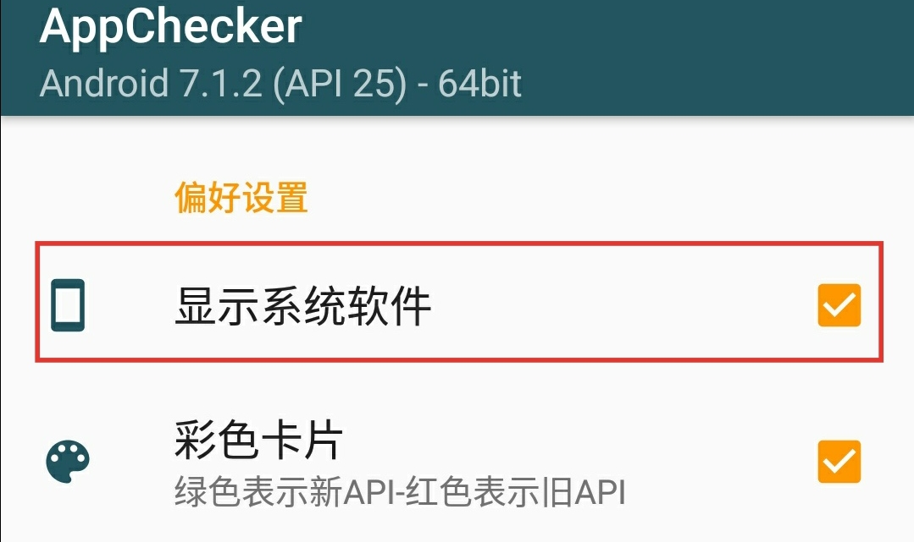
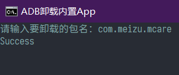

# ADB 卸载安卓内置APP（免ROOT）

## 首先我们需要准备的工具
* [adb.zip](adb.zip) 为了方便使用我已经打包好了
* [appchecker.apk](appchecker.apk) 用于查看包名，如果你的手机有可以查看包名的工具可以不用下载


### 开始卸载
确保手机已经打开开发者选项-USB调试，并且已经授权你的电脑，如果未打开，打开方式为找到系统信息的系统版本连续点击5次系统版本号，即可打开开发者选项


首先，我们设置 appchecker 显示系统文件

 >

  比如我要卸载魅族服务,红色框内即为包名

  >

 回到电脑端，先执行一次
 ```
 adb devices
 ```
 来查看手机是否连接成功，直接双击`0先执行adb devices检查手机连接是否正常.bat`该文件即可，手机连接正常之后,双击`卸载.bat`然后输入刚才看到的包名，比如我就输入`com.meizu.mcare`即可

 >

看到`Success`即为成功卸载。

本例完整的卸载命令(实际执行的命令)为
```
adb shell pm uninstall --user 0 com.meizu.mcare
```