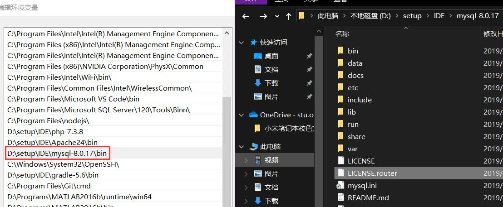

# Mysql8 常用命令
## 安装
[下载地址](https://dev.mysql.com/downloads/mysql/8.0.html) 选择你的系统版本 No Thanks下载
* ### **windows**
为了便于操作先将mysql的路径添加到环境变量，比如我的



然后，`win+x`使用管理员打开命令行，使用如下命令进行初始化，注意记住随机生成的密码（非常复杂的密码）
```
mysqld --initialize --user=mysql --console
```

之后,依次输入如下命令，最后要输的密码即刚刚生成的
```
mysqld -install
net start mysql
mysql -u root -p
```
* ### **Linux 以Ubuntu为例**
首先解压下载下来的tar包
```
tar -vxf *.tar
```
进入解压的文件夹会发现一系列deb包，使用如下命令安装，如果第一步成功不需要第二个命令
```
sudo dpkg -i *.deb //-i install安装deb包
sodo apt --fix-broken install //自动安装缺少的依赖包
```
期间会提示你设置密码，安装完成之后如果出现Access Denied 在命令前加sudo
## 修改用户设置
```
ALTER USER root@localhost IDENTIFIED  BY '123' //修改root密码为123
ALTER USER 'username'@'host' IDENTIFIED WITH mysql_native_password BY 'yourpassword'; 修改用户密码
DROP USER 'username'@'host'; 删除用户
```
## 新建数据
```
show databases;  查看数据库
CREATE DATABASE library;  创建数据库library
use library;  使用library数据库
show tables;    查看有哪些表
CREATE TABLE book(name char(20),author char(20));创建book表，有两个栏 name和author，注意 utf-8 编码下一个中文占三个字节，如果你只知道长度，不确定中英文可以使用varchar

```
实例 Article表
```
create table article(
    `id` int unsigned auto_increment,
    `title` varchar(30),
    `url` varchar(35),
    `creatime` datetime default CURRENT_TIMESTAMP,
    `updatime` datetime default CURRENT_TIMESTAMP on update  CURRENT_TIMESTAMP,
    primary key(id)
);
```
## 增
```
INSERT INTO table VALUES(); 插入到table表
INSERT INTO book(name) VALUES('ni'); 指定栏目插入
ALTER TABLE tablename ADD COLUMN creatime DATETIME;//为tablename表添加新的DATETIME类型的creatime栏目
```
## 删
```
DROP TABLE book; 删除book表
delete from book where id=3; //删除book表中id=3的数据
ALTER TABLE book DROP author;删除book表的author栏 
```
## 改
```
UPDATE book SET name="newvalue" where author="tiaojian"; 修改book表author="tiaojian"处的name为newvalue
ALTER TABLE person MODIFY number BIGINT NOT NULL;修改person 表的number栏为bigint;
```
## 查
```
desc tablename; 查看tablename表的结构
SELECT * FROM tablename；查看tablename的所有数据
select passwd from userinfo where name='okexi';查询name为okexi的passwd的值
select * from guestbook  order by id desc limit 2,4; 倒序查询倒数第3（2+1）条到倒数第6（2+4）条的数据
```

## 授权相关
```
create user 'test'@'localhost' identified by '123'; //创建新用户，只能在本地登录并且密码为123
create user 'test'@'192.168.7.22' identified by '123'; //只可以在IP地址登录
create user 'test'@'%' identified by 'test'; //可以在任何地方登录
grant privileges on databasename.tablename to 'username'@'host' IDENTIFIED BY 'PASSWORD'; 授权
grant all privileges on `test`.* to 'test'@'localhost';   
grant select on test.* to 'user1'@'localhost';  给予查询权限
grant insert on test.* to 'user1'@'localhost'; 添加插入权限
grant delete on test.* to 'user1'@'localhost'; 添加删除权限
grant update on test.* to 'user1'@'localhost'; 添加更改权限
flush privileges; 刷新权限
show grants for 'jack'@'%';查看权限
revoke privileges on databasename.tablename from 'username'@'host';删除权限
```
## 备份还原数据
```
mysqldump -h ip地址 -u 用户名 -B -p 数据库名称 > 文件名称.sql   //使用-B 备份文件含有创建表的命令，直接还原即可
mysqldump -h主机名(ip) -u 用户名 -p -B 数据库 表1 表2 表3 > 备份路径    //备份表
mysqldump -h localhost -u test -B -p users > users.sql  //使用test用户将 users数据库被分到 users.sql 文件，注意windows下使用 cmd进行备份，powershell会乱码
source users.sql;   //登录新的mysql 在mysql下输入，还原数据库
```
### Linux 忘记密码
1. 运行

    `sudo vim /etc/mysql/mysql.conf.d/mysqld.cnf`

2. 在末尾追加

    `skip-grant-tables`

    `sudo service mysql restart`

3. 终端输入mysql进入MySQL，输入USE mysql切换至mysql数据库


    `mysql;`

    `USE mysql;`
 
4. 把root用户的密码修改为空（8版本以上必须先改成空，好像是因为没有password函数）

    ` update user set authentication_string='' where user='root'；`
 
5. 退出重启mysql

    ` flush privileges;`

    `exit`

6. 注释掉`/etc/mysql/mysql.conf.d/mysqld.cnf`文件中添加的一行

    `sudo service mysql restart`

7. 登陆

     `mysql -u root` 如果提示 Access denied 使用`sudo mysql -u root`

8. 修改密码

    `alter user 'root'@'localhost' identified by 'new_password';`
### Windows下忘记 root 密码
1. 使用管理员方式打开powershell（`win+x`)
   
   `net stop mysql`

   `mysqld --console --skip-grant-tables --shared-memory`
2. 另外开一个powershell
   
   `mysql` 即可无密码登入，接下来同Linux 4

