# VS Code 配置运行SpringBoot
## 需要准备的东西
* [Visual Studio Code](https://code.visualstudio.com/#alt-downloads) 建议选择System Installer
* Java
* [Gradle](https://gradle.org/releases/)用于生成jar包，如果你不需要生成jar包可以不必下载
## 开始
首先用 VS Code 打开你需要存放项目的文件夹，在插件里搜索`springboot`，选择一个集成包插件，这样一次就可以安装完全所有的插件


然后按`F1`打开顶部命令栏,输入`spring` Code会自动搜索，选择你的构建方式即可，推荐使用Gradle


然后选择你使用的语言，输入你的项目名称

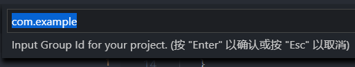

选择你需要使用的Spring Boot 版本

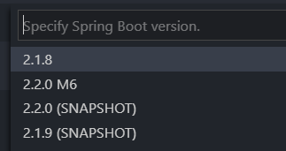

最后添加你需要的依赖项，如果你不清楚需要哪些依赖，推荐你添加以下三个

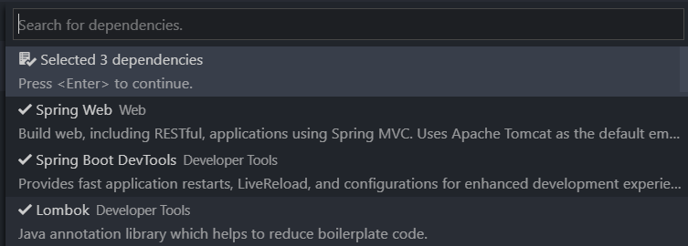

* Spring Web Tomcat客户端，提供服务器，可以实时调试
* DevTools 一些贴心小功能，比如你作出代码更改保存后会自动重启项目以应用更改
* Lombok 支持Lombok注解，省去Set/Get函数，需要注意，这里添加依赖后仅仅是项目支持Lombok注解，VS Code要想实时显示注解需要安装此款插件，才能在代码提示中显示Lombok函数
  
     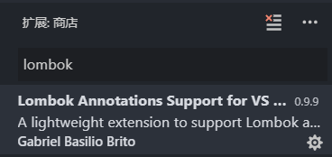
#### 下面开始写我们的第一个Controller（以Java为例）
下面是一个Spring Boot 的推荐目录设置
```
root package结构：com.example.myproject
应用主类Application.java置于root package下，通常我们会在应用主类中做一些框架配置扫描等配置，我们放在root package下可以帮助程序减少手工配置来加载到我们希望被Spring加载的内容
实体（Entity）与数据访问层（Repository）置于com.example.myproject.domain包下
逻辑层（Service）置于com.example.myproject.service包下
Web层（web）置于com.example.myproject.web包下
com
  +- example
    +- myproject
      +- Application.java
      |
      +- domain
      |  +- Customer.java
      |  +- CustomerRepository.java
      |
      +- service
      |  +- CustomerService.java
      |
      +- web
      |  +- CustomerController.java
      |
```
如果你刚刚接触Spring Boot可以先不必按照此目录配置，在使用过程中就会逐渐找到适合的目录设置。这里我们就先在demo目录下创建web文件夹，并创建一个Controller，我这里命名成`MainController`,写入一些代码，你的输入顺序应该是

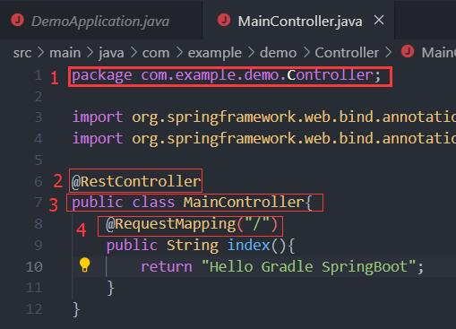

如果你需要返回html文件，把`@RestController`改成`@Controller`把文件放在 resources/static文件夹下直接返回文件名称即可。（不推荐返回页面）文章最后介绍不推荐的原因

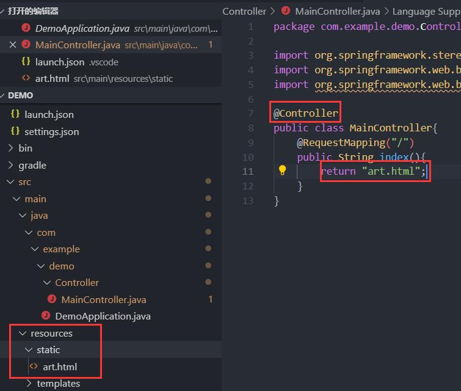


按`F5`启动我们的项目，VS Code会自动帮我们生成`lauch.json`配置文件，在调试界面选择我们的Application，点击小三角，如果你安装了gradle在命令行输入`gradle bootRun`效果相同，不过VS Code 启动可以加断点调试

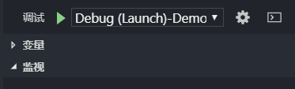

由于我们添加了web依赖，可以看到 Tomcat 已经运行在 8080 端口

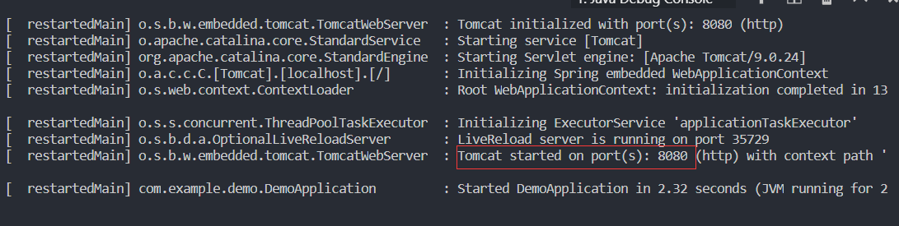

打开浏览器，输入`localhost:8080`即可查看

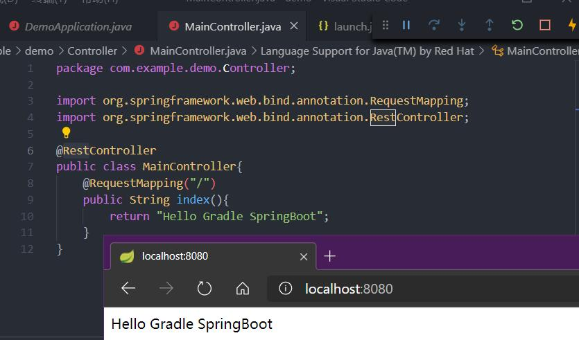

返回html网页的为

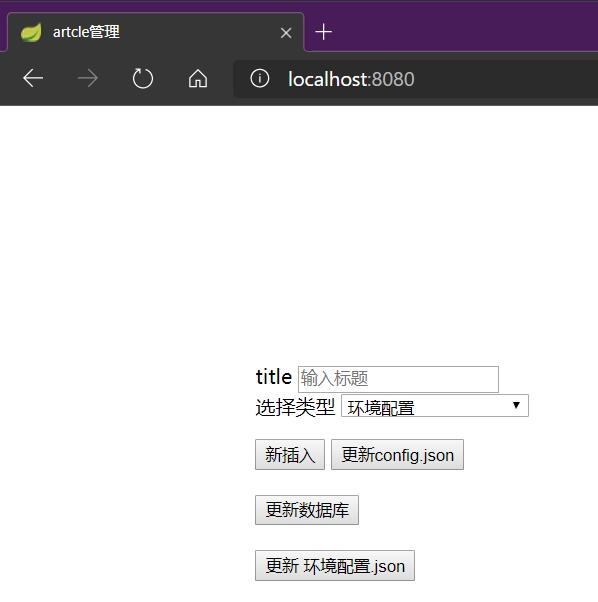

## 移植 jar包到Linux以Ubuntu为例
在命令行输入`gradle build`构建生成项目

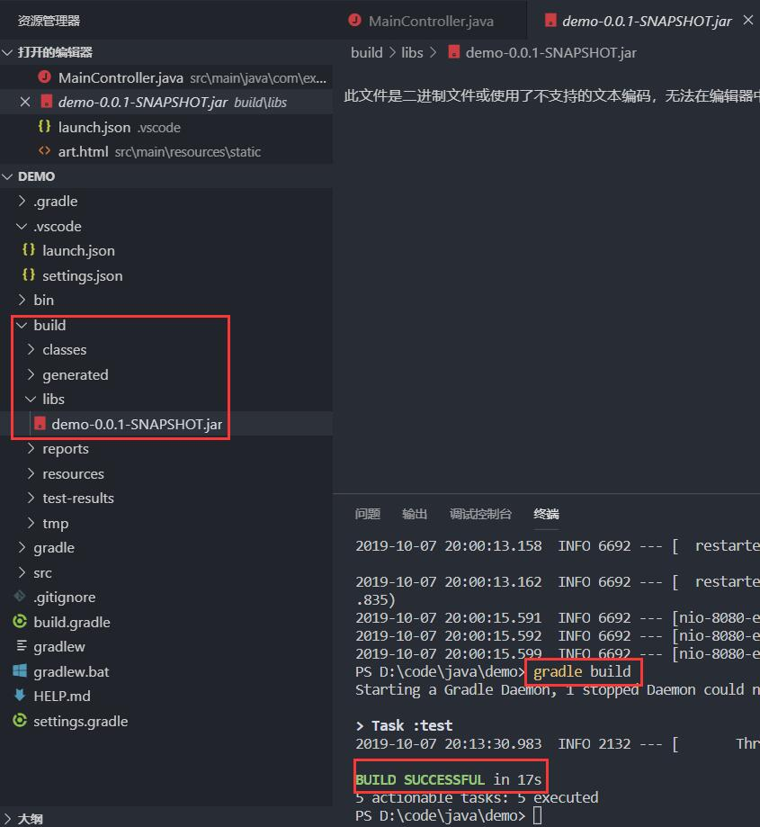

可以在`build/libs`文件夹下找到生成的jar包，我这里使用scp命令发送到Ubuntu

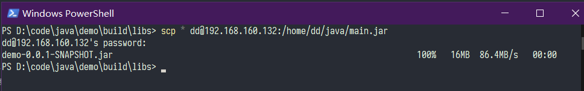

可以看到成功运行

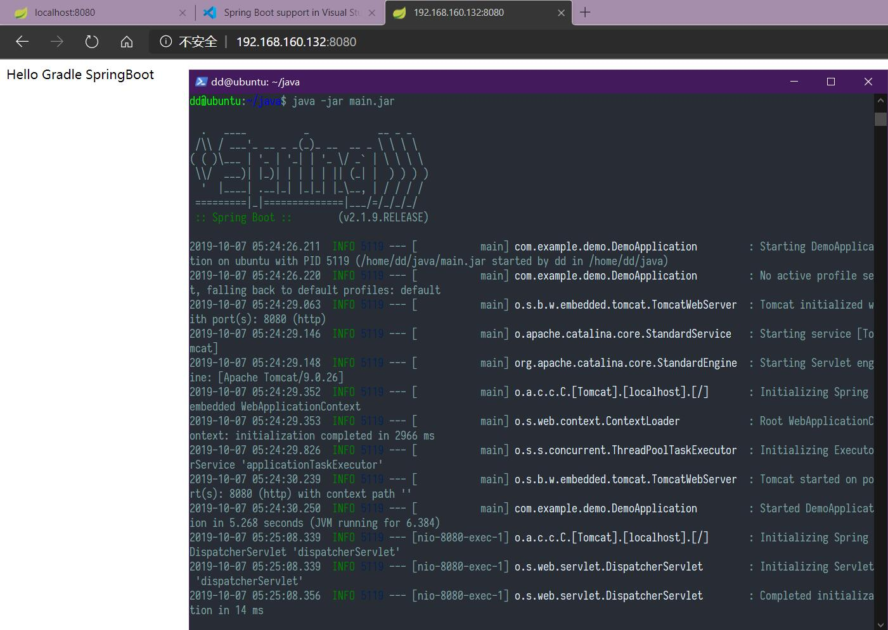

需要长时间运行在后台的话使用`nohup java -jar main.jar > logs & `命令，即可贮存后台可以关闭命令窗口，把命令输出到logs文件

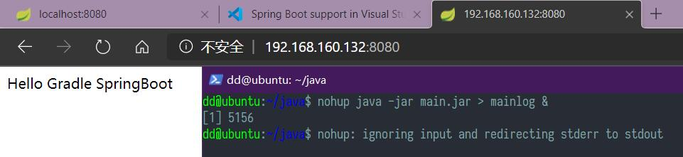

## 最后，使用Nginx作为反向代理
前后端分离的趋势，Nginx是一款优秀的反向代理服务器，借助它可以促使我们的项目前后端分离，静态页面的跳转由Nginx完成，而后端Tomcat仅处理用户数据。这样做的好处很多，比如：实现负载均衡，加速访问，隐藏后端服务器地址，更加安全。关于如何配置Nginx，可以参考我的[这篇文章](../windows下配置nginx/)

这里介绍如何实现负载均衡，打开Nginx的配置文件在`nginx安装目录/conf/nginx.conf`下，设置 `proxy_pass` 后 在`upstream`里添加IP地址即可，后面也可以跟上权重 `weight` 充分发挥服务器的优势

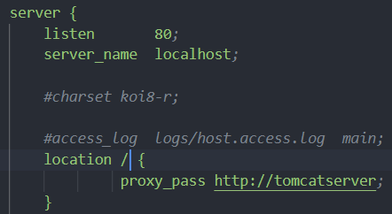

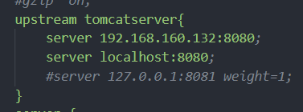

结果如图,我们更改了本地的代码，可以看到两次请求，分别发送到了两个服务器


不过上图的设置所有的请求都被送到了后台，实际使用时不会这样设置，比如我设置为只有以java开头的请求传送到后台


## 真的最后
这是暑假学习的前后端相关知识，最近抽了个时间又走了一遍流程，有了不少新的收获，写下来算是交流经验，同时也给自己加深印象吧。当然这也是基础的一些皮毛，之前我对Java是不怎么感冒的，直到我认识到 Spring 才认识到Java的春天。诸君，共勉！