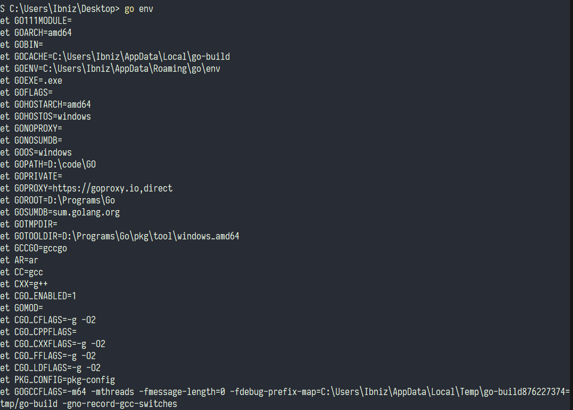
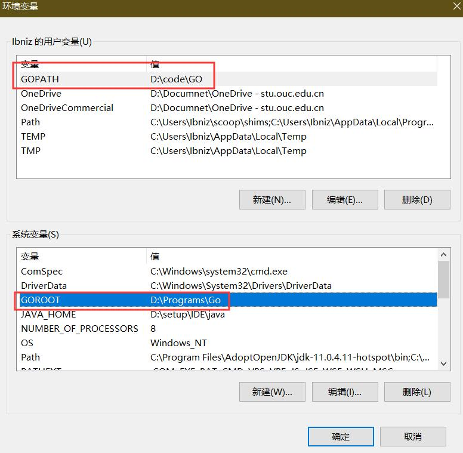
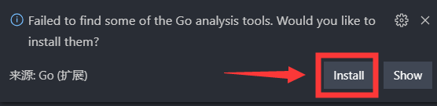
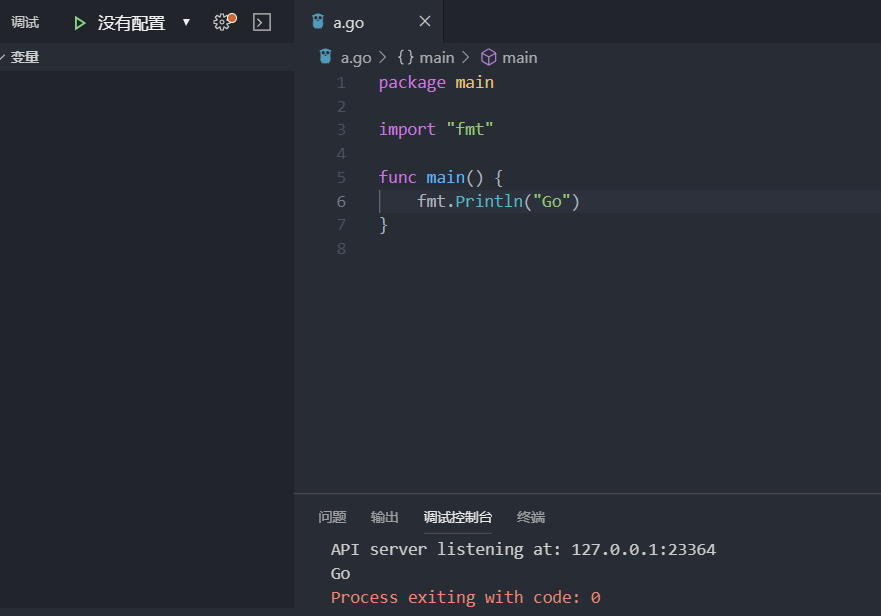
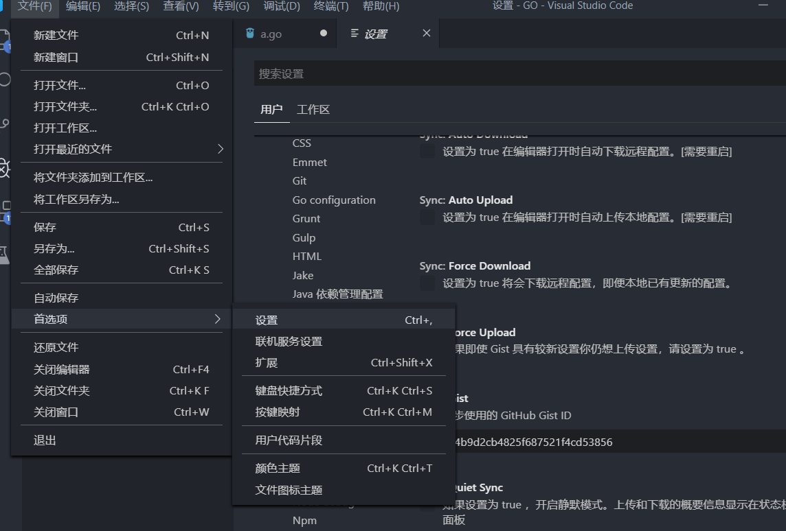
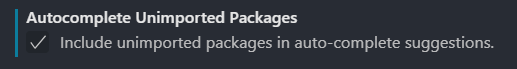
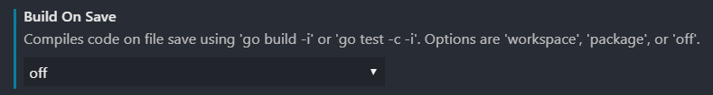
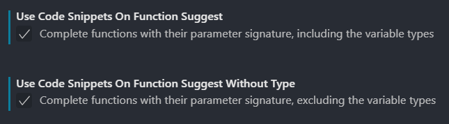
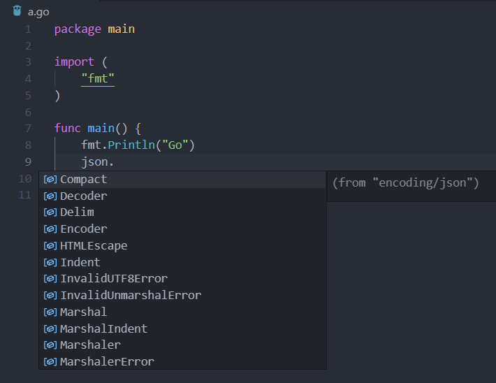

# VS Code 配置 golang 
## 需要的文件
[Go](https://studygolang.com/dl)
## 准备工作
打开命令行 输入 `go env`能打印东西说明 go 安装成功



安装完成 go 后，首先在环境变量里添加
```
 GOROOT go语言安装位置
 GOPATH 你希望的工作目录，后续依赖包会下载到此目录下的 src 文件夹下,如果不指定 会自动创建并下载到用户目录的 go/src文件夹下
 ```
 比如我的
 
 
## 配置 VS Code
新建一个文件夹作为 GO 的编写目录，用 vscode 打开，新建一个 go 文件，然后 点击安装 go 拓展


安装代码检查工具，如果未弹出选项，可以关闭vs code 重新打开




可以看到下载到了 $GOPATH/bin目录下，然后编写代码，按下`f5`或者到调试界面点绿色的小三角就能运行，不需要配置 vs code


## 优化设置，便于使用
设置-拓展 定位到 `GO configuration` 这个就是 go 拓展的设置



打开如下选项
1. 自动导入使用的包

    

2. 关闭保存时构建，有时会带来不必要的麻烦

    

3. 代码自动补全

    
4. 更改 doc tool

    

5. 自动推断go path(可选)

    
6. 如果你想使用在线服务进行代码补全相关，如果你使用 go mod，推荐开启，不使用 go mod 开启的话会找不到同一个包下其他文件的函数
    

完成之后的设置json
```
"go.buildOnSave": "off",
    "go.autocompleteUnimportedPackages": true,
    "go.docsTool": "gogetdoc",
    "go.useCodeSnippetsOnFunctionSuggest": true,
    "go.useCodeSnippetsOnFunctionSuggestWithoutType": true,
    "go.gotoSymbol.includeGoroot": true,
    "go.gotoSymbol.includeImports": true,
    "go.toolsGopath": "D:\\Programs\\Go\\pkg\\tool\\windows_amd64",//这个根据你自己的目录在go root下 （可选）
    "go.useLanguageServer": true,
```
设置完成之后，输入 json 可以看到代码提示，会自动导入 `encoding/json` 包,下图未未开启 language server，输入过程即提示
    


下图未开启 language server ，输入 . 之后才提示


## 开启 go mod
* 使用 go mod 并不要求你的项目源码放到 $GOPATH 下，所以你的新项目可以放到任意你喜欢的路径。在项目根目录下执行go mod init，会生成一个 go.mod 文件。然后你可以在其中增加你的依赖

命令行输入
```
go mod init 你的项目名称（随便）
```
一些常用的 go mod 命令
* go mod download: 下载依赖的 module 到本地 cache
* go mod edit: 编辑 go.mod
* go mod graph: 打印模块依赖图
* go mod init: 在当前目录下初始化 go.mod(就是会新建一个 go.mod 文件)
* go mod tidy: 整理依赖关系，会添加丢失的 module，删除不需要的 module
* go mod vender: 将依赖复制到 vendor 下
* go mod verify: 校验依赖
* go mod why: 解释为什么需要依赖

#### 至此，你的 vs code 已经能够很好的编写 golang 了！