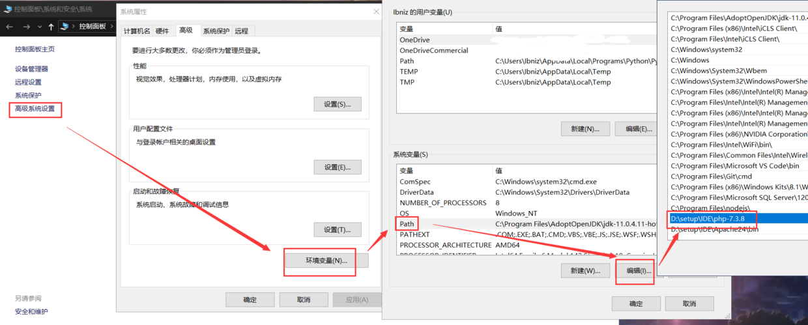
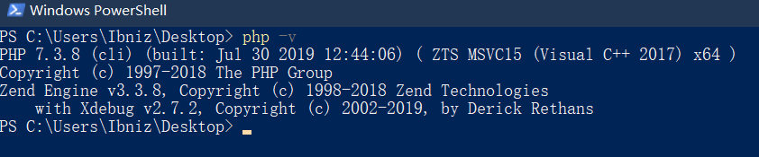
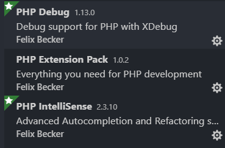
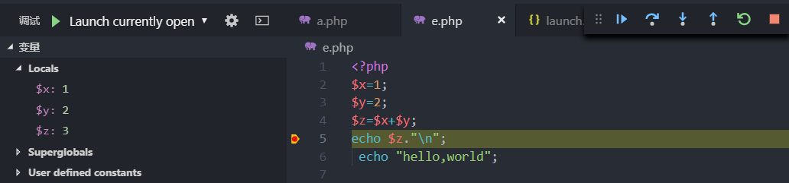

# VS Code配置PHP
## 需要的文件
 * [Visual Studio Code](https://code.visualstudio.com/#alt-downloads) 建议选择System Installer
* [PHP下载地址](https://windows.php.net/downloads/releases/) 
* [Debug拓展下载](https://xdebug.org/download.php)
如果你嫌麻烦，我这有一个打包好的蓝奏云PHP和Debug拓展 [https://www.lanzous.com/i5cnsfi](https://www.lanzous.com/i5cnsfi)
## 开始配置
* 在解压好的PHP目录中新建 ```php.ini```,其中输入
```
zend_extension = 你的目录\php_xdebug-2.7.2-7.3-vc15-x86_64.dll 
//即xdebug的完整路径，比如我的就是zend_extension = D:\setup\IDE\php-7.3.8\php_xdebug-2.7.2-7.3-vc15-x86_64.dll
xdebug.remote_enable = 1
xdebug.remote_autostart = 1
```
* 添加环境变量
>
在PowerShell中输入 php -v,能正常输出php版本信息，即为配置成功


* VS Code配置
  新建一个文件夹用于存放PHP文件，在其中新建一个php文件，然后用VS Code打开，根据提示安装插件，我都安装了，应该可以只安装debug
然后我们随便写点代码，到调试界面，选择添加配置，选择PHP相关的即可，VS Code已经帮我们配置好了。加个断点，F5，调试。OK！


本次教程到此结束。