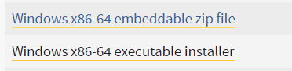
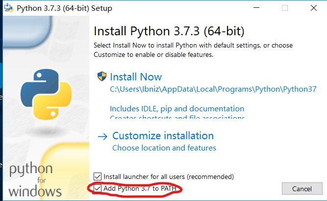
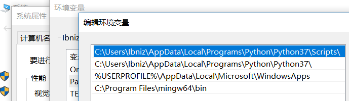
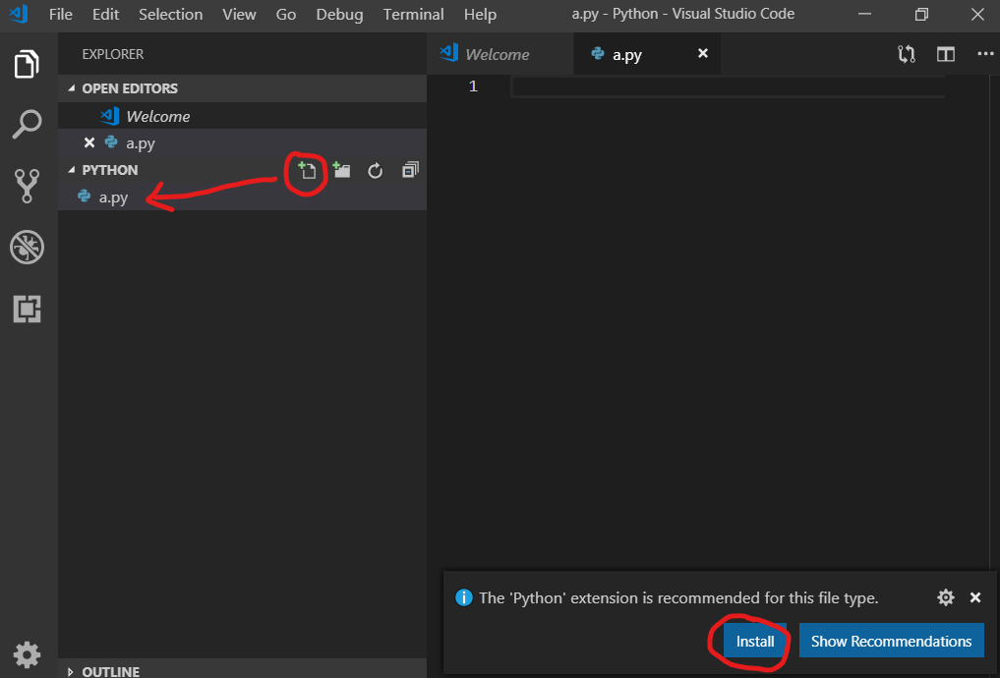
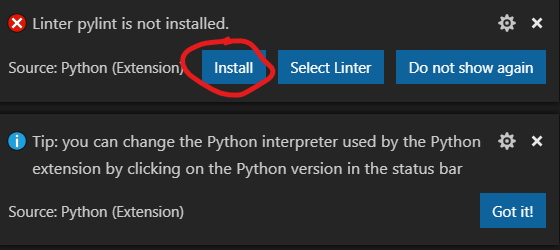
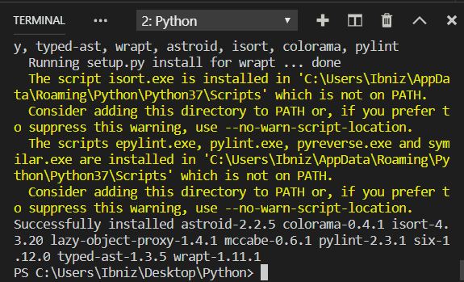
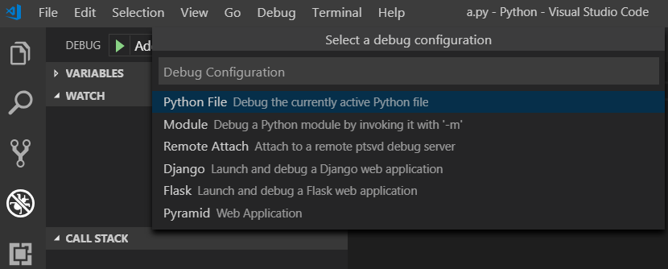
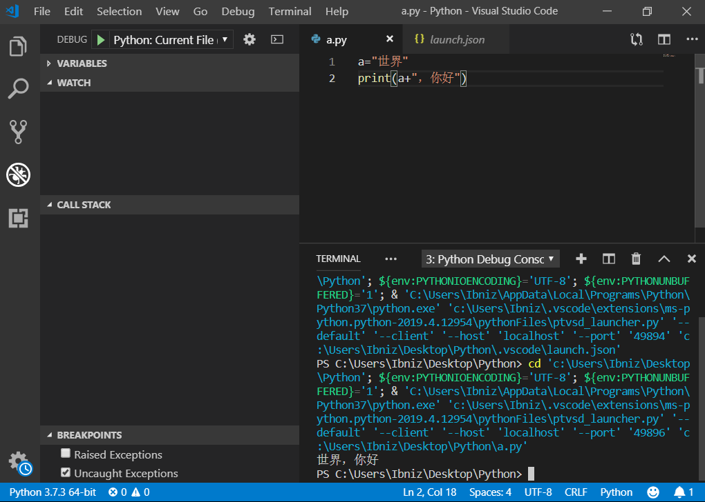
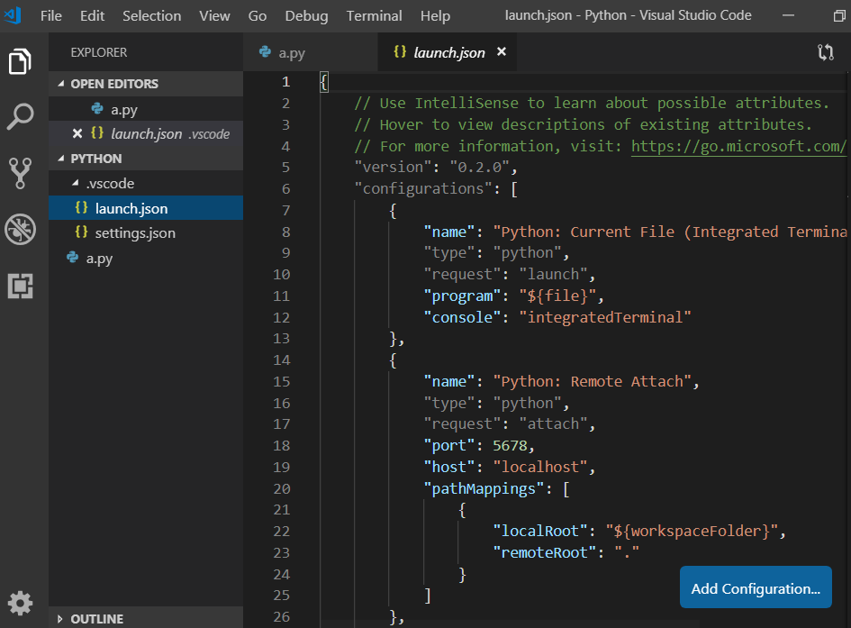
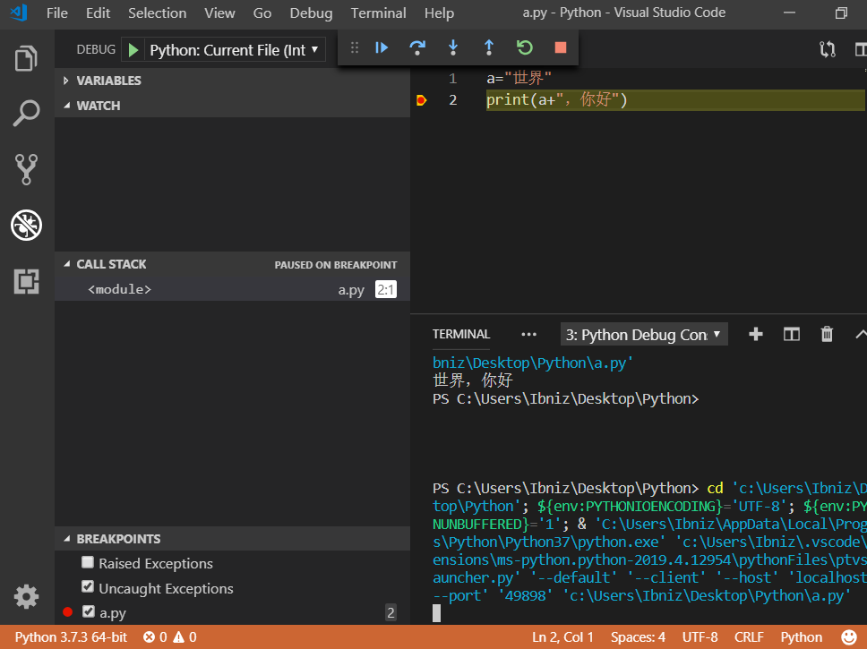

# VS Code 配置Python调试环境
## 需要准备的程序
* [Visual Studio Code]([https://code.visualstudio.com/#alt-downloads](https://code.visualstudio.com/#alt-downloads)
) 建议选择System Installer

* [Python]([https://www.python.org/downloads/release/python-373/](https://www.python.org/downloads/release/python-373/)
) 建议选择安装包，省去添加环境变量的步骤

>即图片中第二个

---
#### 安装Python
安装的时候记得勾选 添加Path，这样就不用自己添加环境变量了
>可以看到Python已经自动添加了环境变量

### VS Code 配置
首先我们新建一个用来存储 Python 源文件的文件夹，因为VS Code 的调试配置文件会自动释放到我们配置时的文件夹内，一个专用文件夹会方便很多。用 VS Code 打开我们新建的文件夹，新建一个.py文件
>

安装完成之后，Python 插件会给出pylint未安装的提示，点击install即可自动安装。
>

接下来我们写一段Python代码，转到调试界面，下拉列表选择Add Configuration，即可弹出如下界面，我们选择第一个选项，即可生成调试配置并调试当前代码
>

可以看到，运行成功
>

我们来看一下自动生成的`launch.json`(在`.vscode`文件夹下）,无特殊要求的话不用修改，常用的就是第一个选项
>

我们加个断点，按调试快捷键`F5`，可以命中断点,调试的两个快捷键与Visual Studio相同，`F10`逐过程，`F11`逐语句。
>

至此你的 VS Code 已经可以编写调试Python了。

---
## 最后推荐几款好用的VS Code 插件
* Chinese (Simplified) Language Pack for Visual Studio Code 
中文插件
* One Dark Pro 
很好看的主题插件
* Tabout 
Tab键跳出右括号，对于习惯了 Visual Studio 的用户超级方便

VS Code 特别适合编写像Python这样的脚本语言，平时写个小工具，不需要IDE，打开便捷迅速，颜值还高。