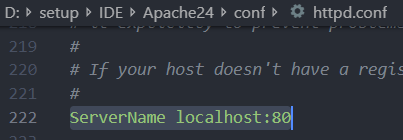
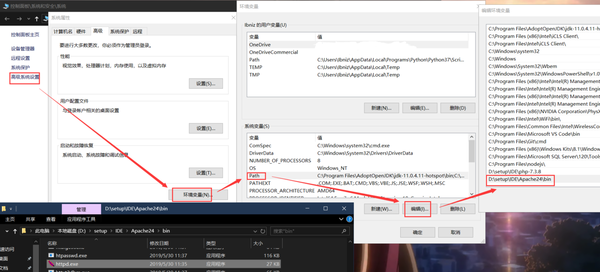
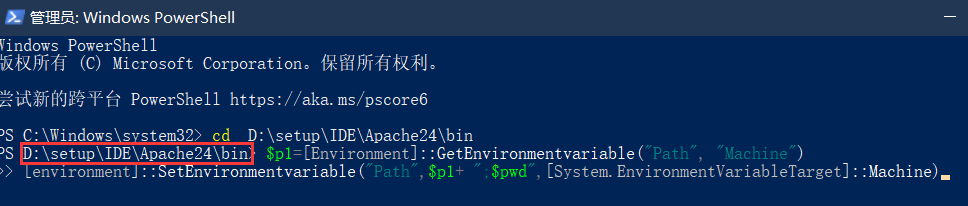
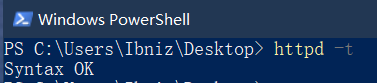
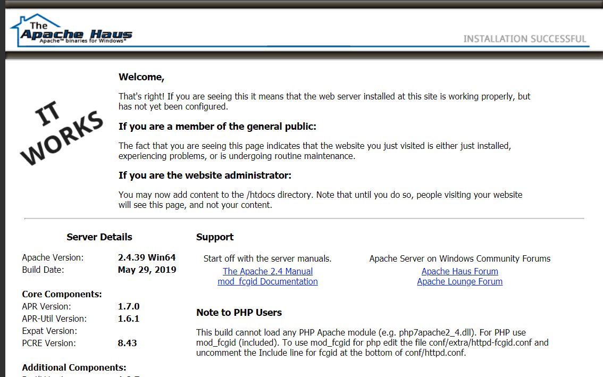

# Windows 下配置Apache运行PHP
## 首先需要准备的文件
* 你的电脑需要具备PHP开发环境，如果不具备，可以参考我的上一篇文章[VS Code配置PHP](../VS Code配置PHP/)

* Apache 下载地址 [https://www.apachehaus.com/cgi-bin/download.plx](https://www.apachehaus.com/cgi-bin/download.plx)


我也传了一个蓝奏云，[https://www.lanzous.com/i5cns8b](https://www.lanzous.com/i5cns8b)
## 开始配置
  在解压出来的Apache `conf`目录下，找到`httpd.conf`并打开,将`Define SRVROOT`后改为自己的APache 绝对位置，图片为我的目录位置


更改`serverName`如图，图片中默认使用80端口，如需更改，更改即可



如果你想指定你编写网页的路径，即Apache打开的默认位置，需要修改`DocumentRoot`项为指定绝对目录，默认为Apache 下的`htdocs`目录。
比如我修改为


可以更改默认打开的文件，默认为 DocumentRoot 目录下index.html


然后拉到最下面，将`Include conf/extra/httpd-fcgid.conf`取消注释，该项待会用来指定PHP目录。如图


然后我们在extra文件夹下找到`httpd-fcgid.conf`，将`Define PHPLOC `后改为自己的PHP绝对路径，如图为我的PHP目录


目前我就修改了这些，能够很好的满足我的需求，若你还有其他需求，仔细看看配置的注释，说不定会找到答案。
* 下面开始安装
为了方便，将`httpd`所在的bin目录添加到环境变量



使用管理员权限运行powershell 执行如下两条命令，可以将运行powershell所在的目录添加到环境变量
```
$p1=[Environment]::GetEnvironmentvariable("Path", "Machine")
[environment]::SetEnvironmentvariable("Path",$p1+ ";$pwd",[System.EnvironmentVariableTarget]::Machine)
```

>

首先，在powershell中输入`httpd -t`来检查配置是否存在问题，若显示OK，



即可进行安装，输入`httpd -k install`安装Apache，安装完成，`httpd -k start`启动服务,也可以到bin目录下找到ApacheMonitor启动服务、查看服务状态


如果你未更改`DocumentRoot`在浏览器输入`localhost`可以看到



我更改了目录，并且目录下没有 index.html，会显示`DocumentRoot`目录，如图


## 测试
写一个简单的代码


可以看到成功执行。现在在就可以在windows下~~愉快的~~写网站了。
## 最后附上几个常用命令
1) 安装apache服务
```
httpd.exe -k install
```

2) 指定要安装的服务的名称（适用于电脑上有几个不同的Apache服务设施）
```
httpd.exe -k install -n "MyServiceName"
```
3) 指定服务配置文件的路径和名称
```
httpd.exe -k install -n "MyServiceName" -f "c:\files\my.conf"
```
注：若不使用特殊参数（如httpd.exe -k install），服务名称为Apache2.X，配置文件为conf\httpd.conf

4) 移除一个Apache服务
```
httpd.exe -k uninstall
```
5) 移除特定的Apache服务
```
httpd.exe -k uninstall -n "MyServiceName"
```
6) 启动已安装的Apache服务
```
httpd.exe -k start
```
7) 停止已安装的Apache服务
```
httpd.exe -k stop || httpd.exe -k shutdown
```
8) 重启已安装的Apache服务(迫使服务重读配置文件，适用于修改配置文件后)
```
httpd.exe -k restart
```