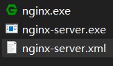
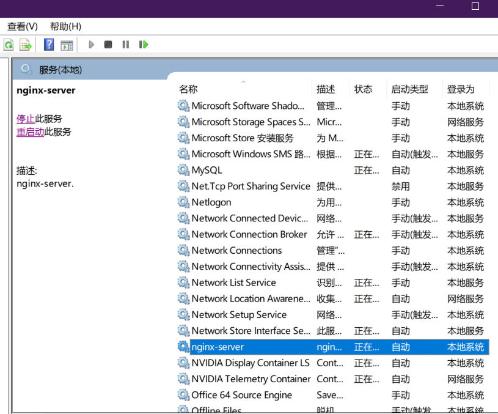
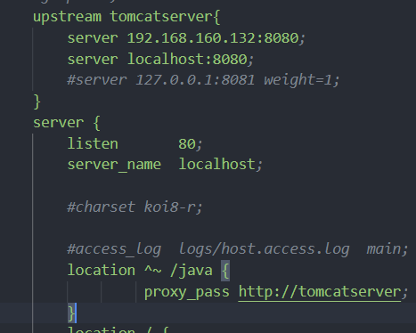
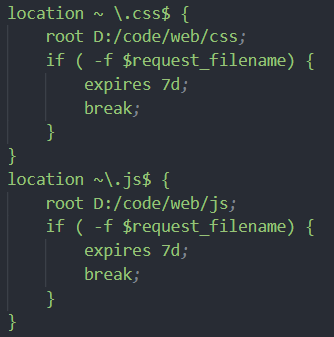

# Windows 下配置 nginx

## 首先需要准备的文件
[Nginx](http://nginx.org/en/download.html)
## 安装

## 开始配置

  ### 作为PHP服务器，以 speedphp 为例
  进入 `nginx`文件夹下,打开`conf/nginx.conf`，添加如下
  ```
  location / {
            root   D:/code/web;//根据你的实际情况输入，此为index.php的目录
            index  index.html index.php index.jsp;//注意添加 index.php
            autoindex on;
             if ( -f $request_filename) {
                break;
            }
            if ( !-e $request_filename) {
                  rewrite (.*) /index.php;
            }
  location ~ \.php$ {
           root           D:/code/web;//根据你的实际情况输入，此为index.php的目录
           fastcgi_pass   127.0.0.1:9000;
           fastcgi_index  index.php;
           fastcgi_param  SCRIPT_FILENAME  $document_root$fastcgi_script_name;
            fastcgi_buffers 8 128k;
           include        fastcgi_params;
        }
  ```
  修改完成后重启nginx或者使用`nginx -s reload`使更改生效
  同时定位到PHP所在目录 执行 `./php-cgi -b 127.0.0.1:9000  -c php.ini` 保持窗口不要关，打开浏览器输入相应地址即可访问
  #### 注册为服务设置自动开启
  首先需要下载[winsw](http://repo.jenkins-ci.org/releases/com/sun/winsw/winsw/2.0.2/),下载后复制到nginx文件目录下，改一个你喜欢的名字，比如我改为`nginx-server`，另外新建一个同名xml，写入一下内容
  ```
  <service>
    <!-- 服务 ID，命令行使用这个名字可以启动/停止服务 -->
    <id>nginx-server</id>
    <!-- 服务名称，可任意，为了方便建议和 ID 一致 -->
    <name>nginx-server</name>
    <!-- 服务描述，任意 -->
    <description>nginx-server.</description>
    <!-- 启动程序名称，不用修改 -->
    <executable>nginx.exe</executable>
    <!-- 停止服务时执行程序名称 -->
    <!-- 解释一下为何用 Win 的 taskkill 命令。因为 Nginx 利用服务启动的情况下无法使用 nginx -s stop 或 nginx -s quiet 命令结束进程，会提示权限不足 -->
    <stopexecutable>taskkill</stopexecutable>
    <!-- 以下三行是 taskkill 的参数，不用修改 -->
    <stopargument>/F</stopargument>
    <stopargument>/IM</stopargument>
    <stopargument>nginx.exe</stopargument>
    <!-- 日志路径，将生成日志至 nginx/logs 目录 -->
    <logpath>logs</logpath>
</service>
```
 
 
 以管理员方式打开命令行，进入改目录 输入`nginx-server install` 即可安装为服务

 

 同样将该文件复制一份到php根目录，重命名为`PHP-CGI`,新建`PHP-CGI.xml`写入如下
 ```
 <service>
    <id>PHP-CGI</id>
    <name>PHP-CGI</name>
    <description>PHP-CGI.</description>
    <executable>xxfpm.exe</executable>
    <!-- 启动参数 -->
    <startargument>"php-cgi.exe -c php.ini"</startargument>
    <startargument>-n</startargument>
    <!-- 启动进程数量，可修改，建议大于 1 -->
    <startargument>2</startargument>
    <startargument>-i</startargument>
    <!-- 监听IP，默认一般都用 127.0.0.1 -->
    <startargument>127.0.0.1</startargument>
    <startargument>-p</startargument>
    <!-- 监听端口，默认一般都用 9000 -->
    <startargument>9000</startargument>
    <!-- 停止参数 -->
    <stopexecutable>taskkill</stopexecutable>
    <stopargument>/F</stopargument>
    <stopargument>/IM</stopargument>
    <stopargument>xxfpm.exe</stopargument>
    <logpath>logs</logpath>
</service>
```
然后 `PHP_CGI install`即可，可以设置服务成自动启动。
### 卸载
需要先停止服务，然后管理员运行命令行到目录下将之前的 install改成 uninstall即可卸载


  ### 作为反向代理服务器
只需要设置好什么请求发送到后端即可，比如我设置的所有以Java开头的请求被传送到后端：设置 `proxy_pass` 后 在`upstream`填入后端服务器的地址和段口即可


可以把一些静态资源同时交由Nginx处理


