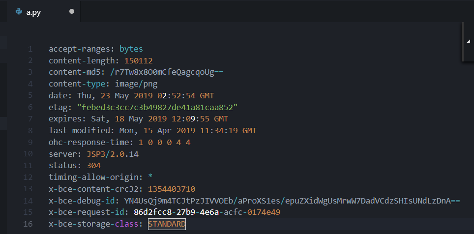
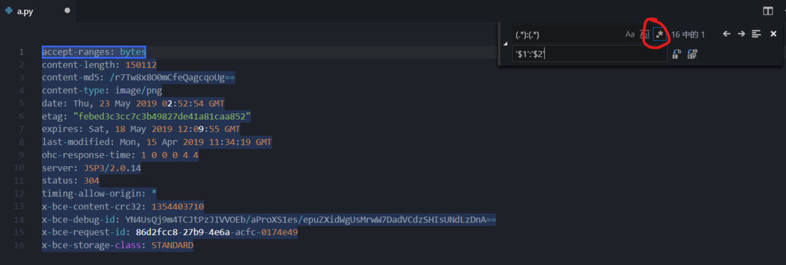
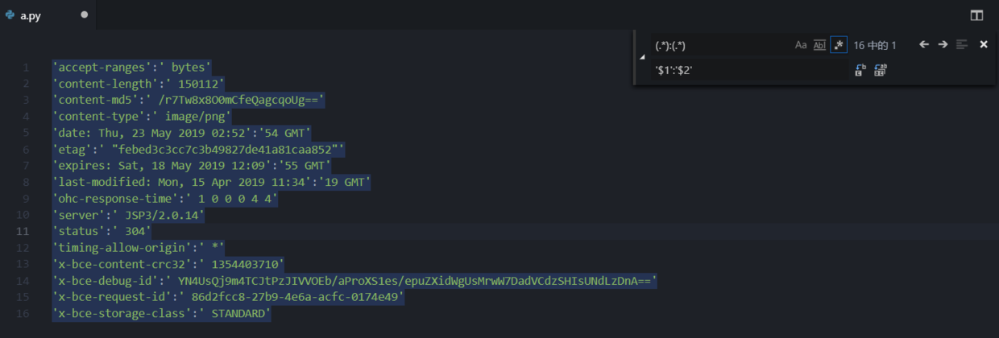
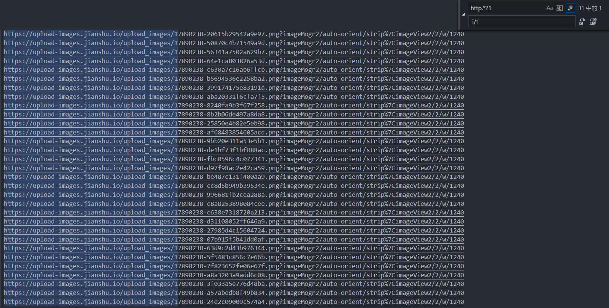
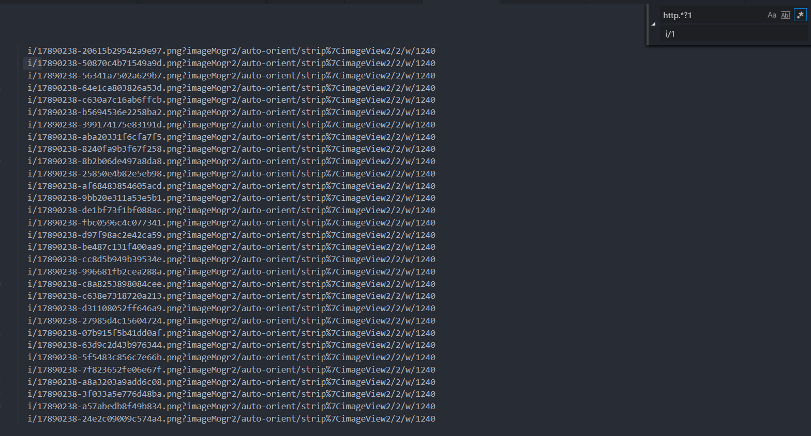
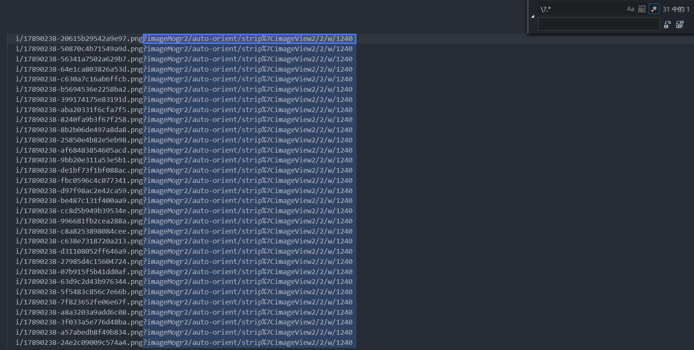
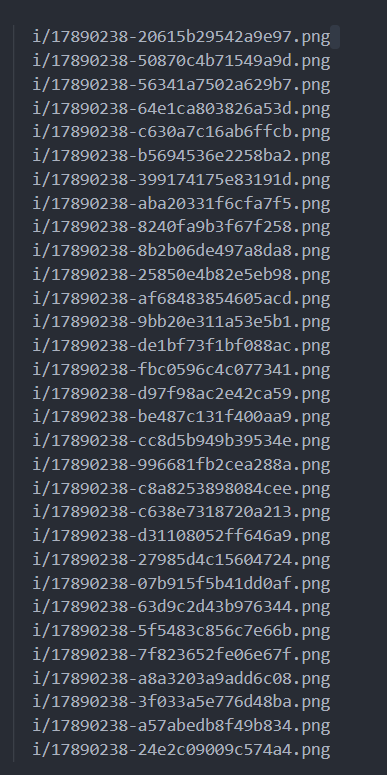

# 巧妙利用正则表达式
  
  * 在Python中我们经常用到类似` 'a':'b' `的表达方式，但是抓包或者从浏览器中复制的参数都是 `a:b` 格式，一个个修改非常麻烦，巧妙利用正则替换能提高工作效率
>例如我们复制的需要用到的信息`a:b` 格式利用正则表达式替换，`Ctrl+H`打开替换选框,选择使用正则表达式，输入如下内容即可替换

* 比如我要将之前简书的图片下载下来用到我的网页上
>之前网页调用的图片地址为,我需要更改为本地地址`i/*`下，可以这样，用`http.*?1`匹配`http任意字符直到1为止`之后，替换为`i/1`，如图后面的用`\?.*`匹配`?至末尾`,
替换为空格，替换完成

